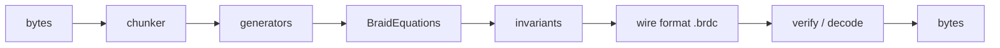

# BraidCodec

[](https://github.com/mehdiskouri/BraidCodec/actions/workflows/ci.yml)
[](https://codecov.io/gh/mehdiskouri/BraidCodec)
[](https://pypi.org/project/braidcodec/)
[](LICENSE)

Topological data codec that encodes arbitrary binary data as braid group equations — simultaneously encrypted, compressed, and integrity-verified through the mathematics of knot invariants.

## How It Works



Data is split into chunks, mapped bijectively to braid generators via mixed-radix encoding, then assembled into `BraidEquation` objects with sector-parameterized R-matrices. Topological invariants (writhe, Jones polynomial, BLAKE3 checksum) are computed per block for integrity verification. The result is a self-verifying `.brdc` wire format.

## Overview

BraidCodec unifies encryption, compression, and integrity verification into a single mathematical framework based on braid groups. Instead of stacking AES + zstd + SHA-256, data is encoded into topological structures where:

- **Confidentiality** comes from sector-parameterized R-matrices acting as trapdoor functions
- **Compression** comes from topological equivalence class collapse (3 levels)
- **Integrity** comes from 5-channel verification (structural, writhe, invariant, fermion, checksum)

## Installation

```bash
pip install braidcodec
```

### Optional dependencies

```bash
pip install braidcodec[cli]      # Command-line interface
pip install braidcodec[quantum]  # Full qiskit for fermion bounds
pip install braidcodec[dev]      # Development tools
```

## Quick Start

```python
import braidcodec

# Generate a key
key = braidcodec.keygen(sector="TSR", n_strands=4)

# Encode data
encoded = braidcodec.encode(b"Hello, topology!", key)

# Decode data
decoded = braidcodec.decode(encoded, key)
assert decoded == b"Hello, topology!"

# Verify integrity
result = braidcodec.verify(encoded, key)
assert result.valid
```

## CLI Usage

```bash
# Generate a key
braidcodec keygen -o my.key

# Encode a file
braidcodec encode data.bin -o data.brdc --key my.key

# Decode a file
braidcodec decode data.brdc -o restored.bin --key my.key

# Verify integrity (5-channel)
braidcodec verify data.brdc --key my.key

# Inspect stream metadata
braidcodec inspect data.brdc

# Run encode/decode/verify benchmark
braidcodec benchmark
```

Exit codes: `0` OK, `1` integrity failure, `2` key mismatch, `3` format error, `4` I/O error.

## Performance

| n_strands | Matrix size | Encode throughput (est.) | Use case |
|-----------|-------------|------------------------|----------|
| 3 | 8×8 | ~5 MB/s | Fast encoding, low security margin |
| 4 | 16×16 | ~2 MB/s | Default: good balance |
| 5 | 32×32 | ~500 KB/s | Higher security, slower |
| 6 | 64×64 | ~100 KB/s | Research use only |

Estimates assume serial encoding with `generators_per_block=32` on a single core. Parallelism scales near-linearly.

## Architecture

```
bytes → chunks → generators → BraidEquations → Jones invariants → wire format
```

The algebra layer provides five core capabilities:
1. **R-matrix construction** — sector-parameterized 4×4 unitary matrices
2. **Braid contraction** — Kronecker products producing 2ⁿ×2ⁿ unitaries
3. **Topological invariants** — Jones polynomial via Kauffman bracket
4. **Equivalence checking** — Yang-Baxter morphism verification
5. **Occupation constraints** — fermionic bounds via Jordan-Wigner

See [docs/architecture.md](docs/architecture.md) for the full layer diagram and data flow.

## Contributing

```bash
# Install dev dependencies
pip install -e ".[dev,cli]"

# Run tests
pytest tests/

# Run benchmarks
pytest tests/benchmarks/ --benchmark-enable

# Lint & format
ruff check src/ tests/ examples/
ruff format src/ tests/ examples/

# Type check
mypy src/braidcodec --strict
```

All PRs must pass CI (lint, typecheck, test with ≥95% coverage).

## Security Disclaimer

BraidCodec is an experimental research project demonstrating topological data encoding. It is **not** a replacement for production cryptographic systems (AES-256, etc.). The security rests on the computational hardness of inverting the Jones polynomial (#P-hard in general), but this specific instantiation has not been cryptanalyzed.

## License

MIT
