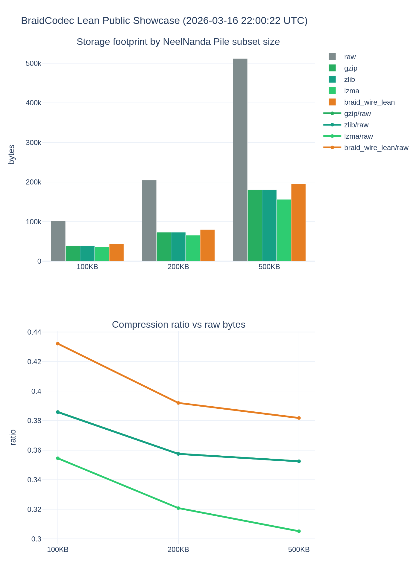

# Public Showcase Benchmark (Lean Path)

- Run: `20260317_150535`
- Data source: `NeelNanda/pile-10k` (`default/train`)
- Target sizes: `100KB, 200KB, 500KB`
- Source rows consumed: `0`
- Used local cache: `True`
- All exact reconstruction matches: `True`
- Headline (500KB): raw `512000` -> braid wire `156056` (69.52% reduction)

This benchmark uses non-duplicated text sampled from NeelNanda's Pile subset and compares BraidCodec lean transport against traditional compressors while enforcing exact reconstruction quality.

## Artifacts

- JSON: `benchmarks/public_showcase/showcase_20260317_150535.json`
- CSV: `benchmarks/public_showcase/showcase_20260317_150535.csv`
- Plot HTML: `benchmarks/public_showcase/showcase_20260317_150535.html`
- Plot PNG: `benchmarks/public_showcase/showcase_20260317_150535.png`

## Plot

