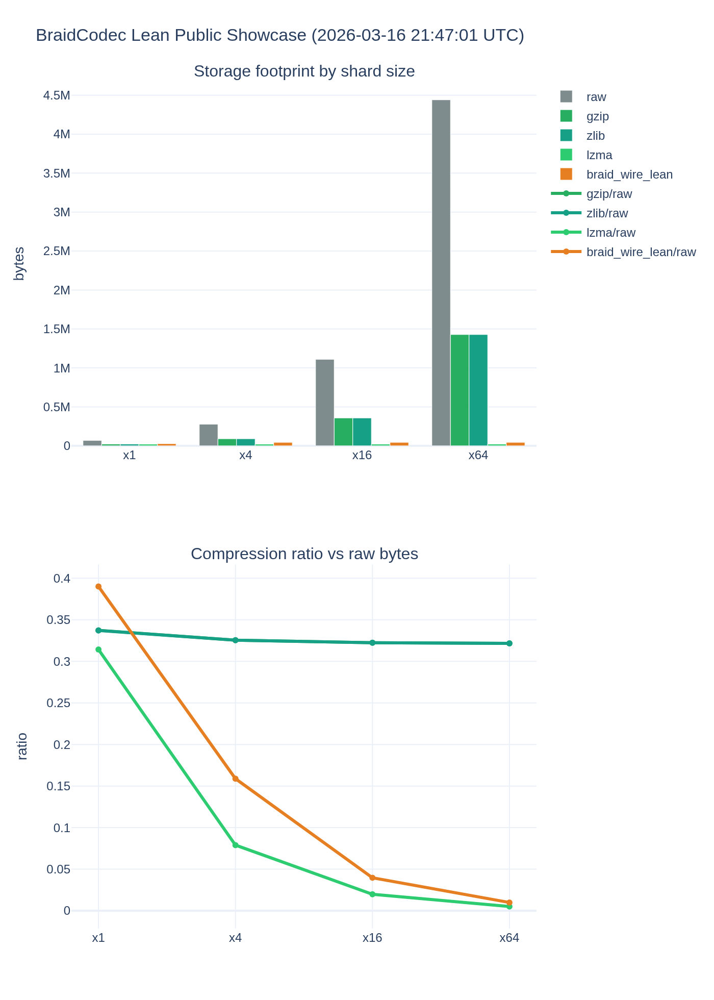

# Public Showcase Benchmark (Lean Path)

- Run: `20260316_214701`
- Repeat factors: `x1, x4, x16, x64`
- All exact reconstruction matches: `True`
- Headline (x64): raw `4440704` -> braid wire `44074` (99.01% reduction)

This benchmark uses a deterministic Pile-like subset of local markdown corpus, builds progressively larger text shards, and compares BraidCodec lean transport against traditional compressors while enforcing exact reconstruction quality.

## Artifacts

- JSON: `benchmarks/public_showcase/showcase_20260316_214701.json`
- CSV: `benchmarks/public_showcase/showcase_20260316_214701.csv`
- Plot HTML: `benchmarks/public_showcase/showcase_20260316_214701.html`
- Plot PNG: `benchmarks/public_showcase/showcase_20260316_214701.png`

## Plot

