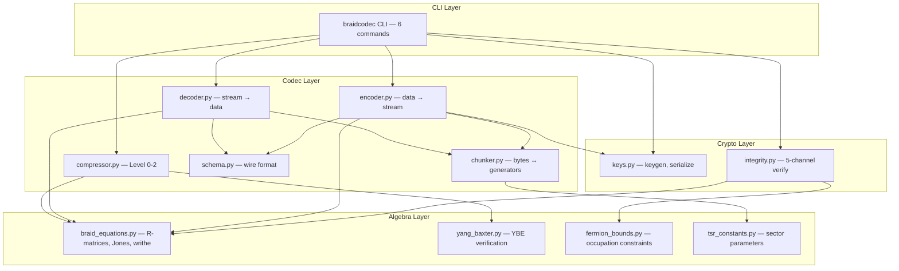
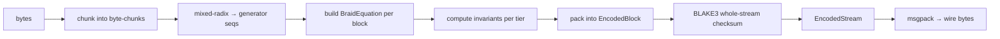
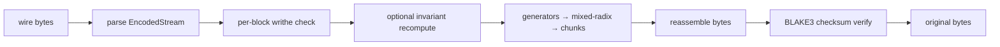

# Architecture

BraidCodec is organized into four layers, each building on the one below.

## Layer Diagram



## Encode Path



1. **Chunking**: Input bytes are split into fixed-size chunks determined by `generators_per_block` and `n_strands`. Each chunk maps bijectively to a generator sequence via mixed-radix encoding.

2. **Braid construction**: Each generator sequence becomes a `BraidEquation` with the key's sector parameters.

3. **Invariant computation**: Writhe (always), Jones polynomial or matrix trace (tiered by block size), and optionally fermion bounds.

4. **Packing**: Generators, invariants, and metadata are packed into `EncodedBlock` dataclasses, then serialized via msgpack with a `BRDC` magic header.

## Decode Path



## Compression

Three levels of topological compression, each preserving the braid's equivalence class:

| Level | Strategy | Typical ratio |
|-------|----------|---------------|
| 0 | Inverse cancellation ($\sigma_i \sigma_i^{-1} \to \epsilon$) | 0.85–1.0 |
| 1 | Far-commutativity reordering + re-cancel | 0.70–0.95 |
| 2 | Yang-Baxter BFS search for shorter representative | 0.60–0.90 |

Compressed blocks store both shortened generators and `decode_generators` (the originals) to ensure lossless round-trip.

## Integrity Verification

Five independent channels, any of which can detect tampering:

| Channel | What it checks | Cost |
|---------|---------------|------|
| Structural | Magic bytes, version, block count, schema | $O(1)$ |
| Writhe | Sum of generator signs per block | $O(k)$ |
| Invariant | Jones polynomial or matrix trace | $O(2^k)$ or $O(k \cdot 4^n)$ |
| Fermion | Occupation constraints (optional) | $O(k \cdot n)$ |
| Checksum | BLAKE3 over reconstructed bytes | $O(\text{data size})$ |

## Performance Characteristics

| n_strands | Matrix size | Encode throughput (est.) | Good for |
|-----------|-------------|------------------------|----------|
| 3 | 8×8 | ~5 MB/s | Fast encoding, low security margin |
| 4 | 16×16 | ~2 MB/s | Default: good balance |
| 5 | 32×32 | ~500 KB/s | Higher security, slower |
| 6 | 64×64 | ~100 KB/s | Research use only |
| 8 | 256×256 | ~10 KB/s | Impractical for large files |

Estimates assume serial encoding with Jones polynomial on a single core. Parallelism scales near-linearly with cores.

## Wire Format

```
BRDC (4 bytes magic)
version (1 byte)
msgpack payload:
  ├── sector (string)
  ├── n_strands (int)
  ├── theta_offset (float64)
  ├── generators_per_block (int)
  ├── invariant_tier (int)
  ├── blocks: [
  │     { generators, writhe, jones, trace,
  │       fermion_parity, decode_generators }
  │   ]
  └── checksum (32 bytes BLAKE3)
```
