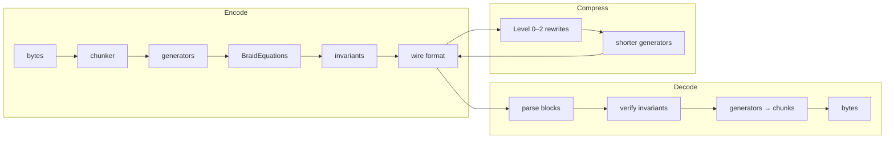

# BraidCodec Documentation

**Topological data codec** — encoding arbitrary binary data as braid group equations, providing encryption, compression, and integrity verification through a single mathematical framework.

## Installation

```bash
pip install braidcodec
```

### Optional extras

```bash
pip install braidcodec[cli]      # Click-based command-line interface
pip install braidcodec[quantum]  # Full qiskit for fermion bounds
pip install braidcodec[dev]      # Development tools (pytest, mypy, ruff, …)
```

## How It Works



## Quick Start

```python
import braidcodec

# Generate a topological key
key = braidcodec.keygen(sector="TSR", n_strands=4)

# Encode data into braid equations
encoded = braidcodec.encode(b"Hello, topology!", key)

# Decode back to original bytes
decoded = braidcodec.decode(encoded, key)
assert decoded == b"Hello, topology!"

# Verify integrity (5-channel verification)
result = braidcodec.verify(encoded, key)
assert result.valid
```

## Documentation

- [Theory](theory.md) — braid groups, R-matrices, Jones polynomial, Yang-Baxter
- [Architecture](architecture.md) — layer design, data flow, tiered invariants
- [API Reference](api.md) — all public symbols, CLI commands, exceptions
- [Benchmarks](benchmarks.md) — throughput tables, compression ratios, how to run

## License

MIT
