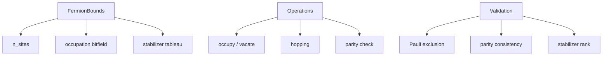
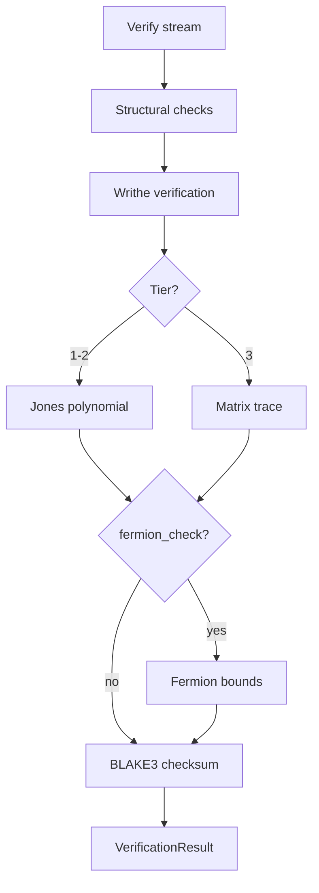

# Theory

Mathematical foundations of BraidCodec's topological encoding.

## Braid Groups

A **braid group** $B_n$ on $n$ strands is generated by elementary crossings $\sigma_1, \sigma_2, \ldots, \sigma_{n-1}$ subject to:

1. **Far commutativity**: $\sigma_i \sigma_j = \sigma_j \sigma_i$ for $|i - j| \geq 2$
2. **Braid relation**: $\sigma_i \sigma_{i+1} \sigma_i = \sigma_{i+1} \sigma_i \sigma_{i+1}$

A braid word is a sequence of generators $ w = \sigma_{i_1}^{\epsilon_1} \sigma_{i_2}^{\epsilon_2} \cdots \sigma_{i_k}^{\epsilon_k} $ where $\epsilon_j \in \{+1, -1\}$.

BraidCodec stores generators as signed integers: $+i$ for $\sigma_i$, $-i$ for $\sigma_i^{-1}$.

## R-Matrices

Each crossing $\sigma_i$ is represented by a **sector-parameterized R-matrix** — a $4 \times 4$ unitary matrix acting on the tensor product of two 2-dimensional spaces at positions $i$ and $i+1$.

The R-matrix has the form of a **phased SWAP**:

$$
R(\theta) = e^{i\theta} \begin{pmatrix} 1 & 0 & 0 & 0 \\ 0 & 0 & e^{i\phi} & 0 \\ 0 & e^{-i\phi} & 0 & 0 \\ 0 & 0 & 0 & 1 \end{pmatrix}
$$

where $\theta$ and $\phi$ depend on the **sector** (a choice of anyon model):

| Sector | Base angle $\theta_0$ | Physical model |
|--------|----------------------|----------------|
| Identity | $0$ | Trivial (no phase) |
| TSR | $\pi/4$ | Temperley-Lieb |
| Ising | $\pi/8$ | Ising anyons |
| Fibonacci | $3\pi/5$ | Fibonacci anyons |
| SU2k2 | $\pi/3$ | $SU(2)_2$ Chern-Simons |

The effective angle is $\theta = \theta_0 + \theta_{\text{offset}}$ where $\theta_{\text{offset}}$ is the key's secret parameter.

## Jones Polynomial

The **Jones polynomial** $V_L(t)$ is a topological invariant of the link closure of a braid. BraidCodec computes it via the **Kauffman bracket** state-sum:

$$
\langle D \rangle = \sum_{\text{states } s} A^{\sigma(s)} (-A^2 - A^{-2})^{|s|-1}
$$

where $A$ is the Kauffman variable (sector-dependent), $\sigma(s)$ is the state contribution, and $|s|$ is the number of loops.

The Jones polynomial is then:

$$
V_L(t) = (-A)^{-3w(L)} \langle D \rangle
$$

where $w(L)$ is the **writhe** (sum of crossing signs).

### Tiered Computation

Computing the Kauffman bracket has exponential cost in the number of crossings. BraidCodec uses a tiered strategy:

| Tier | Condition | Invariant | Cost |
|------|-----------|-----------|------|
| 1 | $k \leq 12$ | Full Jones polynomial | $O(2^k)$ |
| 2 | $12 < k \leq 24$ | Jones polynomial (feasible) | $O(2^k)$ |
| 3 | $k > 24$ | Matrix trace only | $O(k \cdot 2^{2n})$ |

Tier is selected automatically based on `generators_per_block`.

## Writhe

The **writhe** of a braid is simply the sum of the signs of all generators:

$$
w = \sum_{j=1}^{k} \text{sign}(\sigma_{i_j})
$$

This is the cheapest invariant to compute ($O(k)$) and is always verified.

## Yang-Baxter Equation

The R-matrix satisfies the **Yang-Baxter equation**:

$$
(R \otimes I)(I \otimes R)(R \otimes I) = (I \otimes R)(R \otimes I)(I \otimes R)
$$

This ensures that the braid relation $\sigma_i \sigma_{i+1} \sigma_i = \sigma_{i+1} \sigma_i \sigma_{i+1}$ holds at the matrix level. BraidCodec verifies this algebraic identity during key validation.

The YBE is essential for **topological invariance** — braids that are equivalent under Reidemeister moves produce the same Jones polynomial.

## Fermion Bounds

For physical systems, braid operations must respect **fermionic statistics**. BraidCodec implements:

- **Jordan-Wigner transform**: Maps fermionic creation/annihilation operators to Pauli matrices
- **Occupation constraints**: Pauli exclusion — at most one fermion per site
- **Parity conservation**: Total fermion parity ($+1$ even, $-1$ odd) is tracked

The fermion check is an optional verification channel (`fermion_check=True`) that validates each braid block respects the occupation constraints of the key's sector.

## Invariant Hierarchy

